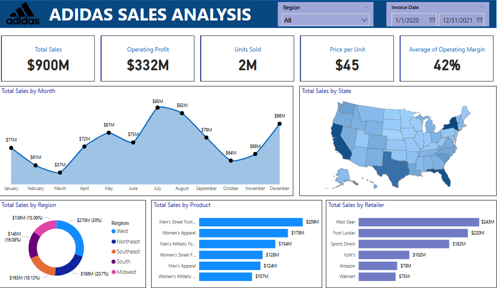

# Data Dashboard & Analysis Portfolio – Intan Pebriyani

## About

👋 Hello! I'm **Intan Pebriyani**, an accounting student with 4+ years of administrative experience and a growing passion for **data analytics**.

This repository showcases my portfolio of **data dashboard and analytical projects** built using **Microsoft Excel, Power BI, and MySQL,** with datasets sourced from **Kaggle**. It reflects my ongoing journey in **data analytics**, where I transform raw data through **cleaning, transformation, and visualization** into insightful dashboards that support **data-driven decision-making** in sales, finance, and business performance.

Each project demonstrates my ability to:

- Collect and clean raw datasets

- Perform exploratory data analysis (EDA)

- Visualize trends and performance metrics

- Present insights in a business-relevant context

📧 ipebriyani@gmail.com  
🔗 [GitHub Portfolio](https://github.com/intanpebriyani/PortfolioProjects)

---

## 📚 Table of Contents

- [About](#about)
- [Tech Stack](#tech-stack)
- [Learning Journey](#learning-journey)
- [Project Overview](#project-overview)
- [Projects](#projects)
  - Adidas Sales Analysis
  - World Population 2024
  - Jatex Annual Sales Report
  - Global Layoffs Data Cleaning & EDA (MySQL)
- [Key Insights](#key-insights)
- [Conclusion](#conclusion)

---

## ⚙️ Tech Stack

    

---

## 🎯 Learning Journey
I'm currently following a structured roadmap to become a Data Analyst, focusing on mastering tools and concepts that build a strong analytical foundation.

Current Focus:

📘 Data Cleaning & EDA with MySQL

📊 Visualization and reporting with Excel and Power BI

📈 Understanding business metrics, statistics, and data storytelling

Next Steps:

📉 Learning Tableau to expand my data visualization and storytelling capabilities

🐍 Learning Python for advanced data analysis, automation, and machine learning

Each step helps me move closer to my goal of becoming a well-rounded data analyst capable of turning data into impactful business insights.

---

## 🔍 Project Overview

Before visualization, all datasets underwent a structured data preparation process:

✅ Removing duplicates

✅ Handling missing or null values

✅ Formatting inconsistent data types

✅ Normalizing text fields and outliers

✅ Ensuring accurate and reliable datasets for analysis

These cleaning steps were crucial to ensure the accuracy and integrity of the insights presented.

---

## 💼 Projects

### 1. Adidas Sales Analysis (Power BI)

**Objective:** Analyze Adidas sales performance across product categories, regions, and time periods.  
**Key Features:**
- $900M in total sales  
- 2M units sold, $45 avg. price  
- Monthly & regional trends, retailer comparison  
- Interactive filters and visuals  
**Dataset:** Kaggle  
**Tools:** Power BI

---

### 2. World Population 2024 (Power BI)

**Objective:** Visualize global population distribution and demographic trends.  
**Key Features:**
- India surpasses China as most populated country  
- Fertility vs. median age analysis  
- Density maps, top 10 least/most populated countries  
**Dataset:** Kaggle  
**Tools:** Power BI

---

### 3. Jatex Annual Sales Report (Excel)

**Objective:** Analyze yearly sales performance, top products, and key customers.  
**Key Features:**
- Voal fabric dominates 68% of sales  
- March & May peak months  
- Top customers and fabric patterns  
- Return & cancellation analysis  
**Dataset:** Kaggle  
**Tools:** Excel

---

## 📈 Key Insights

- **Adidas Sales:** West region leads with $270M in sales. Men’s footwear and women’s apparel are bestsellers.
- **World Population:** India's growing population shifts economic focus. Chad has highest annual growth rate.
- **Jatex Sales:** Sales spike seasonally; Voal and “Polos” are best-selling products.

---

## 🧠 Conclusion

Through these projects, I’ve strengthened my skills in:

- Data cleaning & transformation (SQL, Excel)

- Data visualization (Power BI, Excel)

- Analytical storytelling & business interpretation

- My accounting background complements my analytical mindset — helping me interpret data with both accuracy and business context.

  

📊 I’m continuously learning and open to collaborations in data analytics, business intelligence, and financial data projects.

---
⭐ Thank you for visiting my portfolio! Feel free to connect or share feedback.

