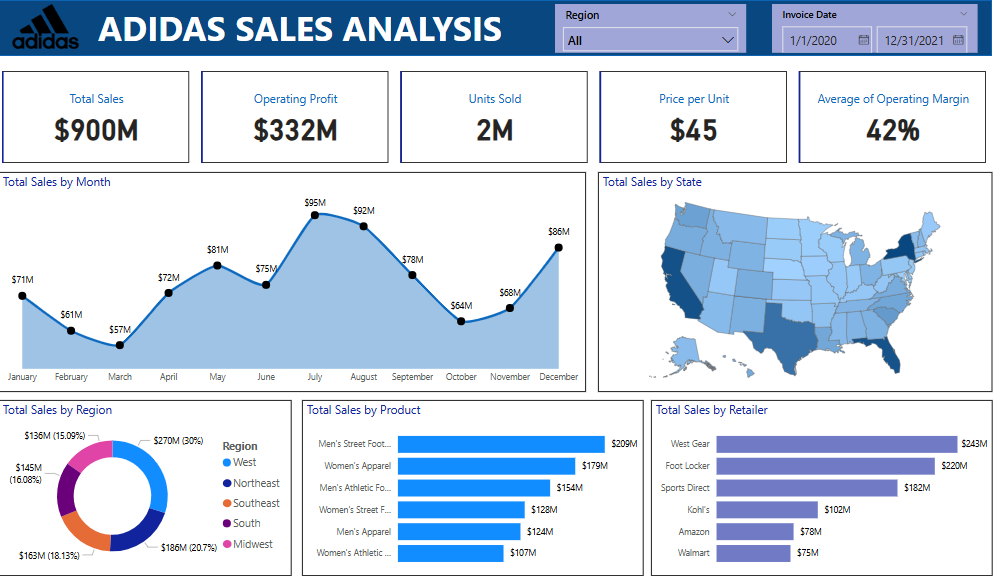

# 📊 Data Dashboard & Analysis Portfolio – Intan Pebriyani

## About

👋 Hi! I’m **Intan Pebriyani**, an Accounting graduate with **4+ years of administrative experience** and a strong interest in **data analytics and business intelligence**.

This repository contains my portfolio of **data dashboard and analytical projects** developed using **Microsoft Excel, Power BI, Tableau, and SQL**, with datasets sourced from **Kaggle** and public data.

Through these projects, I demonstrate my ability to transform raw data into **actionable business insights** through structured data cleaning, analysis, and visualization—supporting decision-making in **sales, finance, and business performance**.

Each project showcases my skills in:
- Data cleaning and validation  
- Exploratory data analysis (EDA)  
- Dashboard design and reporting  
- Business insight communication  

📧 **Email:** ipebriyani@gmail.com  
🔗 **GitHub:** https://github.com/intanpebriyani/PortfolioProjects  

---

## Tech Stack

  
  
  
  
  

---

## Learning Journey

I am currently following a structured roadmap to transition into a **Data Analyst role**, focusing on both technical and business-oriented skills.

**Current Focus:**
- Data cleaning & EDA using SQL  
- Dashboard development with Excel, Power BI, and Tableau  
- Business metrics, statistics, and data storytelling  

**Next Steps:**
- Advanced Tableau dashboards and storytelling techniques  
- Learning Python for data analysis and automation  

---

## Project Overview

All projects follow a structured data preparation process before visualization, including:
- Removing duplicates  
- Handling missing or null values  
- Standardizing data formats  
- Normalizing text fields and managing outliers  
- Ensuring data accuracy and consistency  

This process ensures the insights presented are **reliable and decision-ready**.

---

## Projects

### 1. [Adidas Sales Analysis (Power BI)](https://github.com/intanpebriyani/PortfolioProjects/tree/main/Adidas-Sales-Analysis)

**Objective:** Analyze Adidas sales performance across products, regions, and time periods.  
**Key Features:**
- $900M total sales  
- 2M units sold with $45 average price  
- Monthly and regional performance trends  
- Retailer comparison with interactive filters  
**Dataset:** Kaggle  
**Tools:** Power BI

---

### 2. [World Population 2024 (Power BI)](https://github.com/intanpebriyani/PortfolioProjects/tree/main/World-Population-Analysis)

**Objective:** Visualize global population distribution and demographic trends.  
**Key Features:**
- India surpasses China as the most populated country  
- Fertility rate vs. median age analysis  
- Density maps and top 10 least/most populated countries  
**Dataset:** Kaggle  
**Tools:** Power BI

---

### 3. [Jatex Annual Sales Report (Excel)](https://github.com/intanpebriyani/PortfolioProjects/tree/main/Jatex-Annual-Sales-Report)

**Objective:** Analyze annual sales performance, key products, and customer behavior.  
**Key Features:**
- Voal fabric contributes 68% of total sales  
- Sales peak in March and May  
- Top customers and fabric pattern analysis  
- Return and cancellation trends  
**Dataset:** Kaggle  
**Tools:** Excel

---
### 4. MySQL Data Cleaning and Exploratory Data Analysis (EDA) – Global Layoffs

**Description:**  
This project focuses on cleaning and exploring a real-world dataset of global company layoffs from **2020–2023**. The objective is to transform raw, messy data into a clean and reliable dataset that can be used for meaningful insights and future visualization.

**Learning Source:** Alex The Analyst – MySQL Data Cleaning Tutorial  
**Dataset:** Kaggle – Layoffs Dataset (2022)  
**Author:** Intan Pebriyani  
**Date:** October 2025  

---

**Project Objectives:**
- Perform structured data cleaning to prepare the dataset for analysis  
- Standardize inconsistent fields (company, industry, date, country)  
- Handle missing values and duplicate records accurately  
- Conduct exploratory data analysis (EDA) to uncover trends and patterns  

---

**Tech Stack:**
- **Language:** MySQL  
- **Environment:** MySQL Workbench  

**Techniques Used:**
- CTEs and window functions (`ROW_NUMBER`, `DENSE_RANK`)  
- String and date manipulation (`TRIM`, `STR_TO_DATE`, `SUBSTRING`)  
- Data aggregation (`SUM`, `GROUP BY`)  
- Ranking analysis and rolling totals  

---

**Data Cleaning Steps:**
- Created a staging table to preserve the raw dataset  
- Removed duplicate records using CTEs and `ROW_NUMBER()`  
- Standardized text fields:
  - Trimmed inconsistent company names  
  - Unified industry labels (e.g., Crypto)  
  - Corrected country name formatting  
- Converted date fields from text to `DATE` format  
- Handled NULL values carefully to maintain data integrity  
- Removed rows with no meaningful layoff information  

---

**Exploratory Data Analysis (EDA):**
Key analyses performed after cleaning include:
- **Date Range:** 2020–2023  
- **Top Companies by Layoffs:** Meta, Amazon, Google, Microsoft  
- **Most Affected Industries:** Technology, Retail, Crypto  
- **Top Countries:** United States, India, United Kingdom  
- **Peak Period:** Late 2022 – early 2023  
- **Funding Insights:** Several startups raised large funding before mass layoffs  
- **Rolling Totals:** Cumulative layoffs analyzed using window functions  

---

**Key Insights:**
- Global layoffs surged significantly during **2022–2023**, especially in tech-related sectors  
- Crypto and technology industries experienced the highest workforce reductions  
- The United States accounted for the largest share of global layoffs  
- Startups and late-stage funded companies were among the most affected  
- Layoff activity peaked in **Q4 2022**, reflecting post-pandemic market corrections  

---

**What I Learned:**
- Applying data cleaning logic systematically using SQL  
- The importance of staging tables to protect raw data  
- Detecting and removing duplicates using window functions  
- Creating rolling metrics and structured analysis with CTEs  
- Building a strong foundation for dashboards and data storytelling

---

### 5. [Swiggy Business & Customer Insights (SQL + Power BI)](https://github.com/intanpebriyani/PortfolioProjects/tree/main/Swiggy-Business-And-Customer-Insights)

**Objective:** Analyze food order data to understand customer behavior, pricing patterns, and business performance.  

**Key Features:**
- End-to-end SQL data cleaning and transformation  
- Star schema data warehouse (fact & dimension tables)  
- Monthly, quarterly, and yearly revenue analysis  
- Top cities, restaurants, categories, and dishes  
- Price bucket and rating distribution analysis  

**Dataset:** Public Swiggy food order dataset  
**Tools:** PostgreSQL, SQL, Power BI

---

## Key Insights

- **Adidas Sales:** West region leads with ~$270M in sales; men’s footwear and women’s apparel perform best.  
- **World Population:** India’s population growth reshapes global demographic trends.  
- **Jatex Sales:** Strong seasonality with Voal and Polos as best-selling products.
- **Global Layoffs:** Global layoffs surged significantly during **2022–2023**, especially in tech-related sectors  
- Crypto and technology industries experienced the highest workforce reductions  
- **Swiggy Business and Customer Insights:**

- **Order Volume & Revenue Trends:** Orders and revenue show clear monthly and quarterly seasonality, indicating peak demand periods that can be leveraged for targeted promotions and pricing strategies.

- **Top Performing Cities:** A small number of major cities contribute a significant share of total orders and revenue, highlighting strong market concentration and high customer density in urban areas.

- **Restaurant & Category Performance:** Certain restaurants and food categories consistently outperform others, suggesting opportunities for partnership prioritization and menu optimization.

- **Pricing Patterns:** Mid-range price buckets generate the highest order volume, indicating customers are more price-sensitive and prefer value-for-money options rather than premium pricing.

- **Customer Ratings:** Higher-rated restaurants tend to receive more repeat orders, reinforcing the importance of service quality and customer satisfaction in driving long-term revenue.

- **Data Modeling Impact:** Implementing a star schema (fact and dimension tables) improved query performance and enabled scalable analysis across time, location, and product dimensions.

---

## Conclusion

Through these projects, I have strengthened my skills in:
- Data cleaning and transformation (SQL, Excel)  
- Dashboard development and visualization (Power BI, Excel, Tableau)  
- Analytical storytelling and business interpretation  

My accounting background complements my analytical skill set, enabling me to deliver insights with both **accuracy and business relevance**.

I am continuously learning and open to opportunities or collaborations in **data analytics, business intelligence, and financial data projects**.

---

⭐ Thank you for visiting my portfolio!
